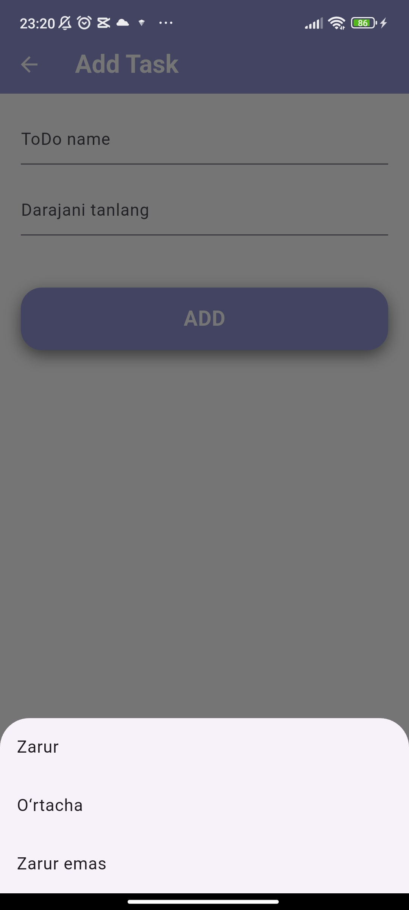
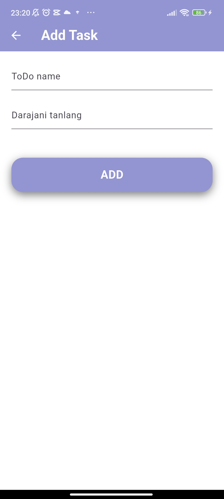
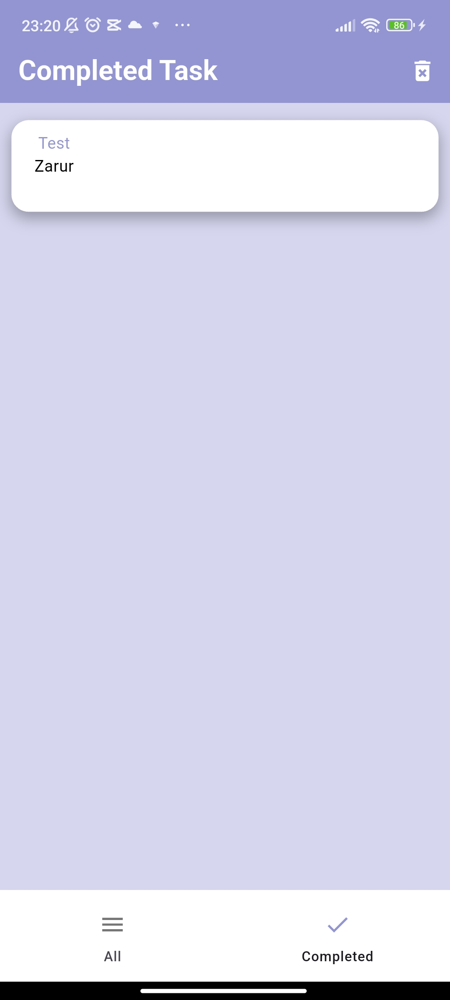
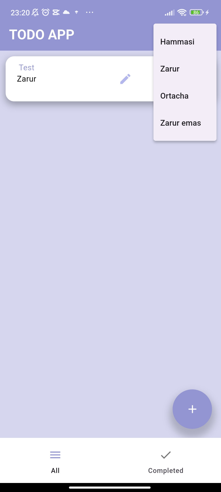

# flutter_todo_app

📝 **Flutter To Do App**

A simple and beautiful to-do app built with Flutter. Organize your tasks and boost productivity with a minimal and efficient interface.

---

## 🚀 Features

- ✅ Add new tasks
- ✅ Mark tasks as done
- 🗑️ Delete tasks
- 📝 Edit tasks

---

## 📸 Screenshots

### ➕ Add Task screen (modal ochilgan holat)

### ➕ Add Task screen (oddiy holat)

### ✅ Task completed (bajarilgan)

### 📝 Edit task screen

---

## 🛠️ Tech Stack
- Bloc
- Hive
- GoRouter
    

